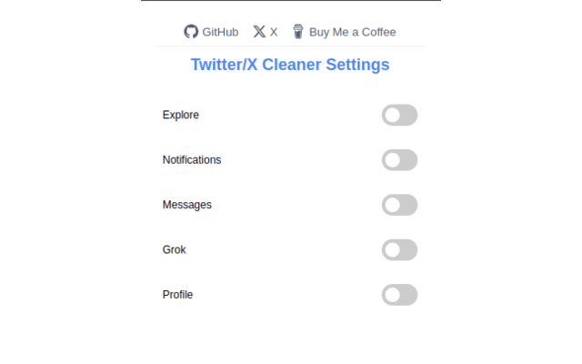

# Twitter/X Cleaner 🧹

  
  

  

*A Chrome extension that helps you declutter your Twitter/X interface by removing unnecessary items from the left sidebar, providing a cleaner and more focused social media experience.* 🚀

## 📸 Screenshots

  
  
Screenshot of the extension in action

---

## ✨ Features

- 🎯 Customizable sidebar cleaning
- ⚡ Real-time updates without page refresh
- 🎨 Easy-to-use popup interface
- 💾 Persistent settings across sessions
- 🔄 Automatic cleaning when navigating Twitter/X

## 📥 Installation

### Chrome Web Store (Recommended)
1. Visit the [Chrome Web Store](https://chromewebstore.google.com/detail/twitterx-cleaner/hgmgflgcnpfoaldhklmifmkclbmooame?authuser=2&hl=en)
2. Click "Add to Chrome"
3. Follow the installation prompts

### Manual Installation (Developer Mode)
1. Clone this repository or download the ZIP file
2. Open Chrome and go to `chrome://extensions/`
3. Enable "Developer mode" in the top right
4. Click "Load unpacked" and select the extension directory

## 🚀 Usage

1. Click the extension icon in your Chrome toolbar
2. Toggle which sidebar items you want to hide/show
3. Changes are applied immediately to your Twitter/X interface
4. Settings are automatically saved and persist between browser sessions

## 🛠️ How It Works

The extension uses a content script to monitor and modify the Twitter/X interface. It:
- 🔍 Automatically detects sidebar elements
- 🎚️ Applies user-defined filters
- 📡 Uses a MutationObserver to handle dynamic content
- 💫 Maintains state across page navigation

## 👨‍🦱 Author

Created with ❤️ by [S4lXLV](https://github.com/S4lXLV)

---

### Support the Project

If you find this extension helpful, consider buying me a coffee! ☕

